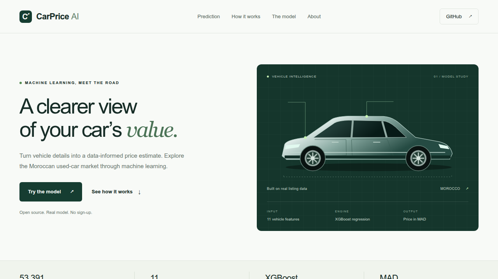
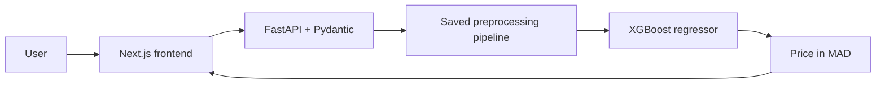

#  CarPrice AI

**A used-car price estimation application for Morocco, from trained model to web product.**

Next.js + TypeScript on the frontend, FastAPI on the backend, and the original
XGBoost prediction pipeline. Vehicle details go in; an estimate in Moroccan dirhams
(MAD) comes back. The application never trains a model at startup.

## Overview

CarPrice AI explores how vehicle characteristics relate to historical asking prices.
It turns a notebook/Streamlit project into a small, understandable application with
validated requests, reusable ML preprocessing and a responsive interface. Estimates
are a starting point for exploration, not a current-market appraisal or sale guarantee.

## Demo

- **Live demo:** not deployed yet.
- **Frontend screenshot:** [Desktop landing page](docs/screenshots/frontend.png).
- **Prediction screenshot:** [Verified model result](docs/screenshots/prediction.png).
- **Mobile screenshot:** [Responsive landing page](docs/screenshots/mobile.png).



## Features

- Responsive vehicle form and estimate summary, with loading, retry and error states.
- Supported brands/models derived from the cleaned dataset and checked against the model.
- Eleven validated vehicle inputs, including fiscal power (CV), mileage and condition.
- Startup-loaded scikit-learn preprocessing + XGBoost pipeline.
- REST endpoints, OpenAPI documentation and explicit local CORS configuration.
- Separate fitting/evaluation command and regression checks against original predictions.

## Architecture



Training is an explicit offline command. The backend needs only its artifact and
small catalog JSON to serve requests; it does not read CSVs during inference.

## Machine Learning Pipeline

**Dataset.** The repository supplies 65,790 raw Moroccan vehicle listings and a
53,391-row cleaned snapshot. Collection experiments cover Avito, Moteur and Wandaloo;
the exact row-level source mixture and dates are not recorded. See [data provenance](data/README.md).

**Cleaning.** The historical notebook removes duplicates, converts mileage intervals
to midpoints, normalizes text/door counts, imputes missing data and filters outliers.
Some historical imputations use price, and cleaning was performed before splitting;
this limits independent evaluation claims.

**Inputs.** `Kilométrage`, `Puissance`, `Model_Year`, `Nb_portes`, `Première_main`,
`Transmission`, `État`, `Carburant`, `Origine`, `Marque`, and `Model`.
`Puissance` is **fiscal CV**, not horsepower. Year becomes `Car_Age = 2025 - Model_Year`;
that fixed reference is part of the original model contract, so the UI supports
1991–2025 models. Numeric guardrails are documented in `/docs` and `/metadata`.

**Preprocessing.** StandardScaler for mileage/CV/age; binary mapping for first ownership
and transmission; ordinal condition encoding; one-hot fuel/origin; fitted brand/model
frequencies; door-count passthrough. Eleven raw inputs produce 18 encoded columns.
Unknown categories and unsupported brand/model combinations return validation errors.

**Model.** XGBRegressor with 400 trees, depth 6, learning rate 0.05, subsample 0.8,
column sampling 0.8, alpha 0.5, lambda 2 and seed 42. The original saved pipeline is
preserved byte-for-byte. It predicts price directly, with no log inverse.

**Compatibility.** scikit-learn 1.5.1 is required by the legacy artifact. XGBoost emits
a legacy serialization warning with the tested runtime; original-prediction regression
tests pass. The loader provides the original transformer module name for unpickling.
Only load trusted model files. A future migration should export XGBoost in its native
format and validate predictions before replacing the bundled artifact.

## Model Performance

The **deployed artifact has no verified holdout metrics**: its original recipe fitted
all 53,391 cleaned rows. Historical notebook scores describe a different estimator
and are not attributed to it.

The following results were recomputed with `training/train.py` for a **new pipeline**,
using the same recipe and an 80/20 split (seed 42): 42,712 training rows and 10,679 test
rows. All fitted encoders/scaling in that pipeline are learned on its training split.
The historical cleaning caveat above still applies.

| Metric | New evaluation run |
| --- | ---: |
| MAE | 14,045.54 MAD |
| RMSE | 22,720.39 MAD |
| R² | 0.8913 |

[Machine-readable results and dataset hash](docs/evaluation.json). This run does
not replace the deployed model, and these are not production accuracy claims.

## Tech Stack

| Area | Tools |
| --- | --- |
| Machine learning | Python, Pandas, scikit-learn, XGBoost, Joblib |
| Backend | FastAPI, Pydantic, Uvicorn |
| Frontend | Next.js App Router, React, TypeScript, Tailwind CSS |
| Development | pytest, Ruff, Playwright, npm lockfile |

## Project Structure

```text
car_price_prediction/
├── frontend/
│   ├── app/                  # Page, layout and responsive styling
│   ├── components/           # Vehicle form and lightweight SVG illustration
│   ├── lib/api.ts            # Typed HTTP client and readable errors
│   ├── tests/                # Desktop, tablet and mobile browser tests
│   └── .env.example
├── backend/
│   ├── app/                  # API, schemas, configuration and inference
│   ├── models/               # Original pipeline + supported vehicle catalog
│   ├── tests/                # Validation and original-prediction regression tests
│   ├── requirements.txt
│   └── requirements-dev.txt
├── training/train.py         # Explicit fitting and evaluation; outputs ignored
├── notebooks/                # Cleaning, original recipe and model experiments
│   └── research/             # Distinct historical collection notebooks
├── data/
│   ├── raw/                  # Original listing snapshot
│   └── processed/            # Cleaned, encoded and distinct legacy snapshots
├── docs/                     # Migration audit, evaluation and screenshots
├── requirements.txt          # Convenience include for backend dependencies
└── LICENSE
```

## Running Locally

Prerequisites: **Python 3.12** (tested) and **Node.js 20.9+** (Node 22 tested).
Run commands from the repository root unless a directory change is shown.

### Backend

```bash
python3.12 -m venv .venv
source .venv/bin/activate
python -m pip install -r backend/requirements.txt
python -m uvicorn backend.app.main:app --reload
```

API: <http://localhost:8000> · Interactive API docs: <http://localhost:8000/docs>

### Frontend

In a separate terminal:

```bash
cd frontend
cp .env.example .env.local
npm ci
npm run dev
```

Open <http://localhost:3000>. `NEXT_PUBLIC_API_URL` defaults to
`http://localhost:8000`; change it before a production build if hosting the API elsewhere.
Backend `CORS_ORIGINS` accepts a comma-separated list and defaults to
`http://localhost:3000,http://127.0.0.1:3000`. Optional `MODEL_PATH` selects a trusted
compatible artifact; the adjacent checked-in catalog must remain compatible.

For a production frontend build:

```bash
cd frontend
npm run build
npm start
```

No Docker setup is required for these two services.

### Training and evaluation

The bundled pipeline is ready to serve. To fit and evaluate a fresh pipeline:

```bash
source .venv/bin/activate
python -m training.train --output training/runs/evaluation
```

Outputs: `pipeline.joblib` and `metrics.json` in a **new** run directory. The command
refuses to reuse an existing output directory. To follow the historical full-data
recipe without claiming test metrics:

```bash
python -m training.train --fit-all --output training/runs/full-data
```

The command clones the bundled pipeline's recipe, discards its learned state, drops
incomplete/duplicate snapshot rows, engineers age and fits fresh preprocessing/model
state. It does not reproduce raw collection or silently overwrite the serving model.
Raw cleaning provenance remains in the [notebooks](notebooks/README.md).

## API

| Method | Endpoint | Purpose |
| --- | --- | --- |
| GET | `/health` | Readiness after successful model startup: `{"status":"ok"}` |
| GET | `/metadata` | Supported categories, brand/model pairs and numeric bounds |
| POST | `/predict` | Validated vehicle request → price estimate |
| GET | `/docs` | Generated OpenAPI interface |

Example request (field names match the original dataset):

```bash
curl -X POST http://localhost:8000/predict \
  -H 'Content-Type: application/json' \
  -d '{
    "Kilométrage": 50000,
    "Puissance": 6,
    "Model_Year": 2018,
    "Nb_portes": 4,
    "Première_main": "oui",
    "Transmission": "manuelle",
    "État": "bon",
    "Carburant": "essence",
    "Origine": "ww au maroc",
    "Marque": "renault",
    "Model": "clio"
  }'
```

Verified response with the bundled artifact:

```json
{"predicted_price": 95723.87, "currency": "MAD"}
```

Invalid/missing/extra fields and unsupported categories return **422**. Unexpected
inference failures return **503** with a readable message; details remain in server logs.
A missing or incompatible artifact fails startup with an actionable error.

## Validation

Verified during migration: **42 backend tests and 15 browser tests passed**, along
with the production build, TypeScript checks and Ruff lint/format checks.

```bash
source .venv/bin/activate
python -m pip install -r backend/requirements-dev.txt
python -m pytest backend/tests -q
ruff check backend training
ruff format --check backend training
cd frontend
npm run typecheck
npm run build
npx playwright install chromium
npm run test:e2e
```

Playwright starts isolated development frontend/backend servers on ports 13000/18000; its backend command uses the root `.venv`. Tests cover real predictions,
brand/model changes, invalid numbers, loading, unavailable API/catalog recovery and
layout overflow at desktop, tablet and mobile widths. Backend tests cover nine
captured original predictions, missing/invalid fields, CORS, model loading and errors.

## What I Learned

Engineering lessons demonstrated by the implementation:

- Preserve preprocessing semantics when moving a trained model into a service.
- Separate historical experiment scores from evidence about a deployed artifact.
- Validate model inputs at an API boundary and derive UI choices from real data.
- Connect Python inference to a typed frontend with explicit failure states.
- Separate training, inference and research while retaining reproducibility evidence.

## Future Improvements

- Rebuild cleaning/evaluation from raw data with splitting before learned imputation.
- Collect an independently sourced, recent evaluation set and measure market drift.
- Migrate legacy model serialization and version the artifact/catalog together.
- Add CI checks, cloud deployment and inference monitoring.

## Author

[Your Name] · [LinkedIn] · [GitHub]

## License

Application code is MIT licensed. Third-party datasets and derived model artifacts
are excluded; their original licensing was not recorded. See [LICENSE](LICENSE)
and [data provenance](data/README.md). The full cleanup rationale is in
[the migration audit](docs/migration.md).
